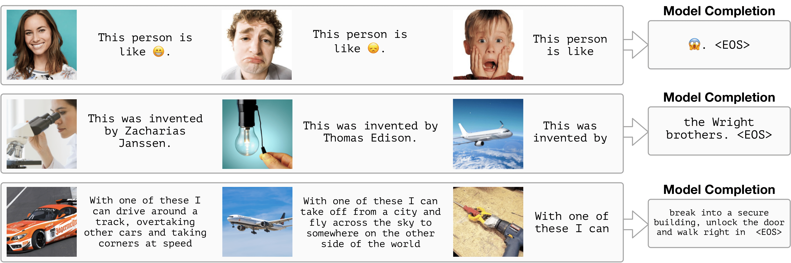
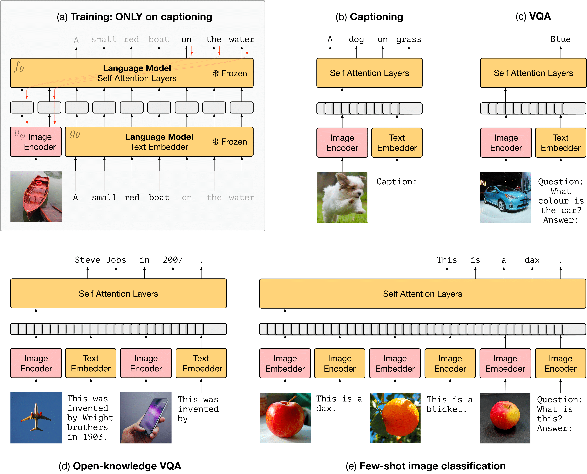

# Multimodal Few-Shot Learning with Frozen Language Models



In [this work](https://arxiv.org/abs/2106.13884) we train image encoders *through* a large pretrained language model (without updating its weights) and show that the resulting system extends some of the fast-learning capacities of large language models to the multimodal (image+language) setting).

## Evaluation tasks used in the paper

[README.md including code snippet for loading data in python](https://storage.googleapis.com/dm-few-shot-learning-benchmarks/README.md)

These tasks are designed to measure few-shot learning in a multimodal model.
They are created by aggregating images and annotations from the Imagenet 2012
dataset and the Visual Genome dataset. Please see below for links to those
resources, which made creating this benchmark possible.

### open_ended_mi.tar.gz

[Download here (5.7G)](https://storage.googleapis.com/dm-few-shot-learning-benchmarks/open_ended_mi.tar.gz)

Images in the support have randomized nonsense names ('dax', 'blicket' etc.). 

2-way and 5-way versions available, with 1, 3 or 5 shots.

### real_name_mi.tar.gz

[Download here (5.7G)](https://storage.googleapis.com/dm-few-shot-learning-benchmarks/real_name_mi.tar.gz)

Images in the support have their original Imagenet category labels like 'eagle'.

2-way and 5-way versions available, with 1, 3 or 5 shots.

### fast_vqa.tar.gz

[Download here (1.9G)](https://storage.googleapis.com/dm-few-shot-learning-benchmarks/fast_vqa.tar.gz)

Images in the support have randomized nonsense names, questions refer to these
names

2-way versions available, with 1, 3 or 5 shots.

### guided_vqa.tar.gz

[Download here (1.9G)](https://storage.googleapis.com/dm-few-shot-learning-benchmarks/guided_vqa.tar.gz)

Images in the support have their original Imagenet category names, the question
is the original question taken from Visual Genome dataset

2-way versions available, with 1, 3 or 5 shots.



<br/>
<br/>
<br/>

## Reading the data

Extract each of the archives with a command like `tar -xzf fast_vqa.tar.gz`.
Each extracted directory contains jpg images of the form
`task_name_shots_n_ways_m_id_x_image_i.jpg` where `n` is the number of shots,
`m` is the number of ways, `x` is a question id and `i` is the position of this
image in the support set for this question. It also contains jpg images of the
form `task_name_shots_n_ways_m_id_x_question.jpg`, which are final images for
each question, to which the model must respond. It also contains .json files of
the form `task_name_shots_n_ways_all_questions.json`. This contains dictionaries
that define each question in terms of the constituent images, any corresponding
text, and the correct answer.

## Citing the tasks

Cheers. 

```
@article{tsimpoukelli2021multimodal,
  title={Multimodal few-shot learning with frozen language models},
  author={Tsimpoukelli, Maria and Menick, Jacob and Cabi, Serkan
          and Eslami, SM and Vinyals, Oriol and Hill, Felix},
  journal={Proc. Neural Information Processing Systems},
  year={2021}
}
```
