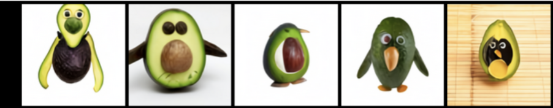
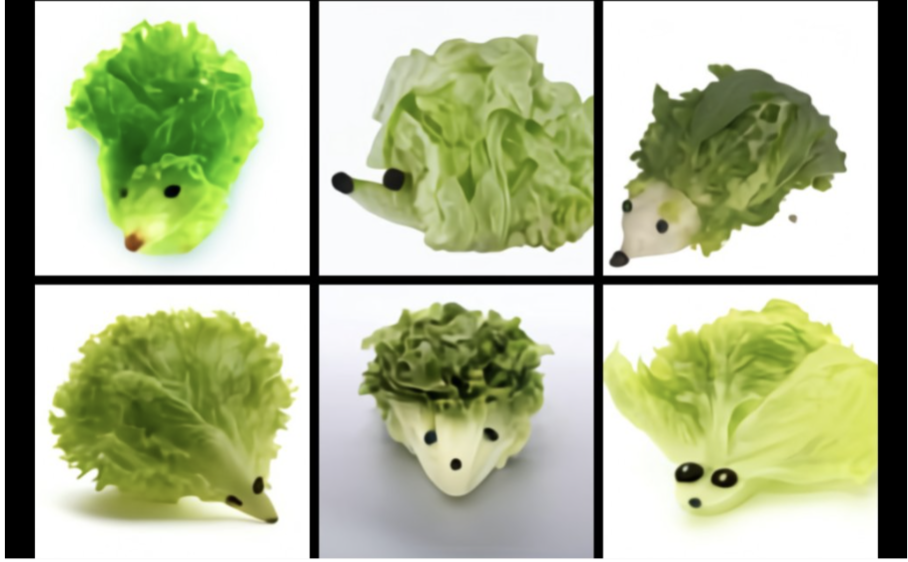
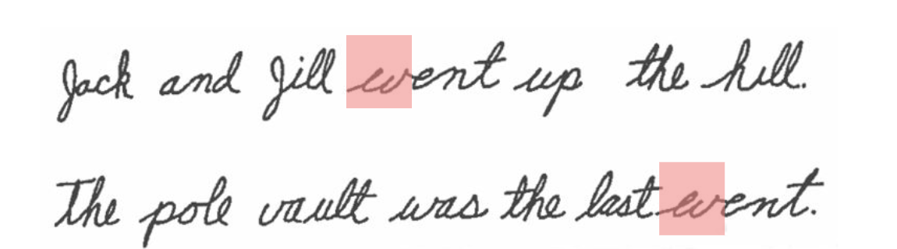

# NonCompositional

A Twitter-length blog about language and cognition. Written in a rush, because time flies like an arrow (whereas fruit flies like a banana). 

Each entry is also a chain of Tweets. To respond and engage, just [follow me on Twitter](https://twitter.com/felixhill84?lang=en)

 

## Why composition is DALL-E's strength, not its weakness

 

  

 

When we compose meanings, concepts, semantics or any other 'elements' of cognition, the outcome is not easily predictable like it is when we compose functions in mathematics or operations in a computer programme. 

We all know, without really even having to think, that a *wine hangover* is a hangover **caused by** wine, but a *college town* is a town **that has a** college. It seems obvious to us that a *honey bee* is a bee **that produces** honey, but that a *mountain lodge* is a lodge **located on** a mountain.

We can perform similar magic with *snow blindness*, *bacon grease*, *glass cubes* and *daisy chains*. And we can do it when we haven't seen the combination before. Do you know what a *zoo gun* is? I bet you can make a reasonable guess, and I bet most of our guesses are similar. What about a *gun zoo*? We all know what a *pen knife* is, but it's kind of amusing to imagine what a *knife pen* would be like. 

These cases illustrate an amazing fact about language: that the meanings of two innocent-looking words typically combine in radically diverse and complex ways. Nothing on the surface of the language tells us that we should treat each of the above cases differently, yet we can all cook up these very different recipes in our mind, and, I bet, with surprisingly few differences of opinion.

Unfortunately, there is no known well-understood process or procedure for determining how the meanings of two words should combine to form a single coherent meaning. This simple fact may be the single clearest explanation for why the endeavour of modelling language with symbolic or rule-based systems -- attempted with great vigour and on a large scale continuously from the end of second world war until at least 2010 -- seems to have failed. 

Considering the examples above, perhaps the only useful rule that we *can* infer about composition is that the final result seems to depend on lots of different things. These include, but are perhaps not even limited to: our knowledge of how things might naturally fit together given the physical and social constraints of the world that we live in, our prior experience with the specific combination or other combinations that we judge to be similar and our intuition for what somebody might be trying to say to given the way the current conversation is going. We may be consciously aware of some of these factors, and unaware of others.

Now, [DALL-E](https://openai.com/blog/dall-e/) doesn't get any information about conversational context so it can't possibly take that into account. In fact, it can only learn about the world from still images, so its implicit 'world model' must necessarily be very *visual*, likely quite biased towards the sorts of things that get photographed and then collated into image datasets, and lacking insight into physical constraints, motion, forces etc. 

Nevertheless, and given these caveats - DALL-E makes what viscerally seem to be remarkable attempts to account for the prototypical meanings of input words and satisfy both the physical and conceptual constraints of the world. 

When asked to imagine a *lettuce hedgehog*, it puts the ends of the lettuce leaves towards the back of the hedgehog where the spikes would be, it merges them into a single contiguous object, it creates eyes and noses (things that a hedgehog has) out of specks of dirt that wouldn't look too out of place in a salad.

 

  

 

Similarly, when it constructs an *avocado chair*, it seems to do so in a way that fits with how our subconscious intuitions about how these two things should be combined. The avocado could be sitting on the sofa, or the chair could be located on the avocado, or it could be a chair sitting in a salad, or all manner of other ways of combining the two concepts. 

But something about the way DALL-E *avocados* the chair just feels right to us. 

 

  

 

And surely we all must agree that this is the only right and proper way to toucanize a hedgehog. 

 

  

 

This is why it makes no sense to criticise DALL-E (or neural networks in general) for their poor composition. It is precisely because their composition is surprisingly good that emotions have been stirred and people are enjoying tweeting and sharing these things so much!

#### Yeah, all good fun, but we can't learn anything scientific or conceptual from this brute-force approach

Well, I'm not so sure. Let's consider a bit more history....

The eccentric, multivariate, non-linear nature of semantic composition was one of the key motivations for a group of psychologists to develop some of the earliest artificial neural networks. [Rumelhart](https://pdfs.semanticscholar.org/5828/f6e9baf5727e37968a43957e6b9405e6887a.pdf), [Hinton](https://web.stanford.edu/~jlmcc/papers/PDP/Chapter3.pdf), [McClelland](http://stanford.edu/~jlmcc/papers/McClelland92.pdf) and a few others understood that these data-driven, learning-based models had the potential to acquire conceptual knowledge of the world while respecting the subtleties and eccentricities of the data. Moreover, because such knowledge is distributed throughout weights of the network, including all levels of input processing, it must necessarily constrain the representations that the model constructs when presented with the inputs like words in the raw form. 

In other words, in neural networks, the input and prior knowledge could interact in a way that wasn't possible in competing, more modular, symbolic or rule-based approaches to modelling semantic cognition. 

If we were composing smooth, closed-form mathematical functions, these symbolic approaches would probably work very well. But they do not work very well when modelling language. So, if we are looking for scientific insight, one thing that we can learn from this brute-force approach is that language (and meaning) is not like mathematics. Any hard imposition of encapsulation or modularity seems to be unhelpful; what performs best is a model that can acquire background knowledge from data and that allow this knowledge to interact with input processing at all levels of representation and abstraction.

#### OK, but what about systematicity?

As pointed out in the OpenAI blog, DALL-E performs worse when asked to imagine *a green cube on a red cube on a blue cube* than to imagine a lettuce hedgehog. This is a bit disappointing, because we can imagine a green cube on a red cube on a blue cube quite easily. However, as pointed out by [Tomer Ullman on Twitter](https://twitter.com/TomerUllman/status/1346669277420650498?s=20), once we get above three objects, this gets quite tricky for us too. It's actually quite a headache to imagine (or sketch) a *green cube on a red cube on a blue cube on a yellow cube on a purple table*. 

Interestingly, my bet is that we would observe a clear difference in how well children do at the cube-scene sketching task between the ages of 4 and 12. We would probably also observe clear differences between the final sketches between cultures where people have a formal education and [those that do not](https://science.sciencemag.org/content/182/4112/553), and also between populations that received the description in a one-off audible instruction and those who could repeatedly consult a written version. The potential to learn the sort of systematic mental processes that allow us to construct multi-object scenes from such a description probably also benefits from our being physical beings who see, feel and hear the world from a first-person perspective, and practice [physically arranging things](https://www.pnas.org/content/117/42/25966). 

So, DALL-E is not as systematic as young children, and far less systematic than formally-educated adult humans with either perfect memories or a pen and paper. But all is not lost. Understanding what makes humans systematic and what makes some much more so than others can provide us with insight into how to create models with the remarkable compositional skills of neural networks *and* the systematicity we desire as well. 

First, we might like to think of ways in which a model like DALL-E could be enabled to actively-perceive and learn to interact with its surroundings. We already know that doing so can make a substantial difference to [how systematic a deep neural network is](https://arxiv.org/abs/1910.00571). Second, we could consider what is the best proxy for a formal education for such a network. We know that such networks get more systematic through repeated practice at problems that require systematicity, particularly when the correct answers are [contrasted with carefully chosen alternatives](https://arxiv.org/abs/1902.00120). And third, we could attempt to develop better [memory systems](https://arxiv.org/abs/2009.01719), so that a model or agent can know, for instance, when it is repeating itself and credit itself for doing so when doing so leads to positive outcomes.

#### In summary

It's wrong to say that DALL-E is bad at composition  (or *compositionality*, [whatever that even means](https://fh295.github.io/noncompositional.html)). DALL-E is probably better than any machine that we've encountered before at composition - that's exactly why everyone is so excited! 

It is precisely what appears to be an instinct for combining words in a way that respects many of the constraints of the world -- and in doing so matching our shared expectations and intuitions -- that is what make's DALL-E's predictions seem so magical to us. 

And it is not a surprise that such a capacity came from a deep neural network; it was exactly for these reasons that a few psychologists in the late 1970s and 80s developed models of this type and applied them to language when few others were interested.

On the other hand, as the example with stacking cubes shows, DALL-E is not particularly systematic. 

It is a worthy endeavour to research ways to make models like DALL-E as systematic as the smartest humans, particularly if we would like a system that can also do something like science or maths. But the fact that DALL-E isn't very systematic is not a fundamental limitation that proves the whole approach is wrong. 

That said, to overcome this limitation, advocates of data-driven approaches to learning from vision and language, myself included, will need to become increasingly systematic in the way we educate our models.

 

*Thanks to [Diarmuid](https://www.cl.cam.ac.uk/~do242/)'s [PhD](https://www.cl.cam.ac.uk/techreports/UCAM-CL-TR-735.pdf) for many of the examples of noun compounds, and lots of great people on Twitter for the fun examples from OpenAI's DALL-E generator.*

 
 

### Building a situation representation

First, think about whether this sentence makes sense or not.  

&nbsp;&nbsp;&nbsp;&nbsp;&nbsp;&nbsp; *The haystack was important because the cloth ripped*

Most people say it seems grammatical but is incoherent. Perhaps it was generated by a (badly-tuned) neural language model!  

Now [click here](parachute.md) before reading on.

Hello again. Take another look at that sentence. 

&nbsp;&nbsp;&nbsp;&nbsp;&nbsp;&nbsp; *The haystack was important because the cloth ripped*

Most people say that after clicking on the link, the sentence now makes sense to them.

The context on which language understanding depends is very often perceptual or social. Understanding language involves constructing a representation of a scene based on how we understand the world. 

 *McClelland, J. L. (1992). Can connectionist models discover the structure of natural language?* 

 

### Top-down vs. bottom-up

How we interpret any language sequence depends on (1) what's in that sequence (2) the immediate "context" around that sequence *and* (3) our knowledge of how the world works. Look here:

  

We read the ambiguous highlighted character as 'w' in one context and 'ev' in another. Phrase or word perceptions depend trivially on letter perceptions but crucially letter perceptions also depend on word or phrase perceptions. The dependency goes both up *and* down the stack of abstraction. 

This isn't a special quirk of reading and orthography. Top-down effects also affact how we hear sounds. Look here:

<blockquote class="twitter-tweet">
These break my brain <a href="https://t.co/0tgko0BBm6">pic.twitter.com/0tgko0BBm6</a>
&mdash; The Layman&#39;s Linguist (@LaymansLinguist) <a href="https://twitter.com/LaymansLinguist/status/1212778825697939456?ref_src=twsrc%5Etfw">January 2, 2020</a></blockquote> 

Help me out here: what's compositional about that?  

 *Rumelhart, D. E. (1976). Toward an interactive model of reading* 

 

### Word disorder

Languages differ in the extent to which the order of words affects the meaning. 

For English it's pretty important. In *man bites dog*, *man* being first tells us that the man did the biting. But this could also be marked directly on the words, e.g. with inflections (*bites dog manitwasme!*).

The Australian language Warlpiri has entirely arbitrary word order. When you ask a Warlpiri native speaker to repeat an utterance directly back to you, more often than not they alter the word order, apparently without realizing.

When you think about it, that's kind of wild! They just don't notice the word order, it doesn't enter their memory. A bit like when we as English speakers can't hear the difference between *bruder* (German for 'brother') and *brüder* ('brothers').

Latin is a free-word-order language too. So Nero or Augustus might have had the same 'disorder'.

 *Hale, Kenneth L, Mary Laughren, and Jane Simpson. 1995. Warlpiri.'XXI. Syntactic Sketches' in Syntax. An International Handbook of Contemporary Research.* 

  *Evans, N., & Levinson, S. C. (2009). The myth of language universals: Language diversity and its importance for cognitive science. Behavioral and brain sciences, 32(5), 429-448.* 

 

### Polysynthetic languages

[Ray Mooney](https://www.cs.utexas.edu/~mooney/) famously doubted whether [the meaning of a sentence could fit into a single vector](https://www.cs.utexas.edu/~mooney/cramming.html), but polysynthetic languages cram the meaning of a sentence into a single word.

In the Australian language Bininj Gun-wok, *abanyawoihwarrgahmarneganjginjeng* means (approximately) "I cooked the wrong meat for them again."

In Cayuga, an American language, *Ęskakhehna’táyęthwahs* means "I will plant potatoes for them again."

In Yupik, a Siberian language, *tuntussuqatarniksaitengqiggtuq* means "He had not yet said again that he was going to hunt reindeer."

Polysynthetic languages are not an exceptional isolated occurrence. They are  more frequent in the Americas, Australia, Siberia, and New Guinea, but can be found in other places too. 

Does it make sense to say that these languages have a single word for a whole sentence? Who defines what a word is? 

Well, like words in English, speakers agree on exactly where they begin and end, and unlike sentences in English, they agree exactly on where any stress should be placed, and they don't accept periods of pause in the middle.

 *Mithun. 1983. The genius of polysynthesis. North American Indians: Humanistic Perspectives. University of Oklahoma Papers in Anthropology 24(2)* 

 *Evans, N. & Sasse, H. –J., eds. (2002) Problems of polysynthesis. Akademie Verlag.* 

 

### My favourite treatments of compositionality in the literature

[Compositionality](
https://adele.princeton.edu/wp-content/uploads/sites/277/2019/12/Compositionality-Routledge.pdf) by [Adele Goldberg](https://en.wikipedia.org/wiki/Adele_Goldberg_(linguist))

 

[A Case for Deep Learning in Semantics](https://web.stanford.edu/~cgpotts/temp/pater-commentary-by-potts.pdf) by [Christopher Potts](https://web.stanford.edu/~cgpotts/)

&nbsp; .... *The usual story is that compositionality is crucial to our ability
to produce and understand creative new combinations of linguistic units, because it offers
guarantees about the systematicity and predictability of new units. However, these observations alone do not imply compositionality. The interpretation of a given phrase could be
systematic, predictable, and also determined in part by global properties of the utterance,
the speaker, the discourse situation, and so forth. And, indeed, it seems to me that our
everyday experiences with language are in keeping with this. Listeners greedily use all sorts
of information when making sense of others’ utterances, and speakers assume they will do
this.* ...

 
 

>> More to follow soon
